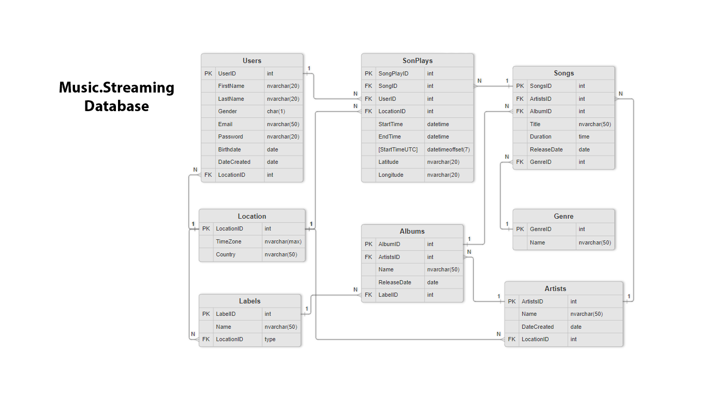

# MusicStreaming Database

## Descrição do Projeto

O projeto **MusicStreaming Database** simula a base de dados de uma plataforma de streaming musical 24/7. Desenvolvido como parte prática da Academia Database & Data Intelligence, aborda desde a modelagem até estratégias avançadas de segurança, performance e relatórios.

A solução contempla:
- Modelagem e estruturação de entidades (usuários, músicas, artistas, álbuns, editoras, gêneros, etc.).
- Segurança, permissões e criptografia.
- Extração de relatórios e insights via SQL.
- Técnicas de performance como particionamento e compressão de dados.

## Pré-requisitos

- **SQL Server 2019+** (ou compatível)
- **SQL Server Management Studio (SSMS)** ou ferramenta similar
- Permissões de administrador para criação de banco, usuários e jobs

## Instruções de Execução

1. **Modelagem e Dados**
   - Execute `database/01-modelagem/criacao-de-esquema.sql` para criar as tabelas e relacionamentos.
   - Execute `database/01-modelagem/insercao-de-dados.sql` para popular as tabelas.
2. **Consultas e Relatórios**
   - Utilize `database/02-queries-relatorios/consultas-e-relatorios.sql` para gerar relatórios e análises.
3. **Segurança e Automatização**
   - Execute `database/03-seguranca-automacao/procedures-var-tde.sql` para criar procedures de segurança, análise de vulnerabilidades e criptografia (TDE).
   - Execute `database/03-seguranca-automacao/seguranca-agendamento.sql` para criar usuários, permissões, aplicar mascaramento e agendar backups.
4. **Gestão Avançada e Performance**
   - Execute `database/04-performance-gestao/particionamento-compressao.sql` para aplicar particionamento e compressão.
   - Execute `database/04-performance-gestao/temp-tables-views-triggers.sql` para exemplos de views, triggers e tabelas temporárias.

> **Dica:** Consulte a [documentação técnica detalhada](docs/readme-docs.md) para links diretos e explicações de cada script.

## Exemplos de Uso

- Consultar as 10 músicas mais tocadas:

  SELECT TOP 10 TituloMusica, TotalReproducoes FROM #ContagemReproducoesPorMusica ORDER BY TotalReproducoes DESC;

- Executar procedure de auditoria de jobs:

  EXEC ListJobsAndSchedules @JobName = 'BackupJob', @DataInicial = '2024-01-01', @DataFinal = '2024-12-31';

- Consultar dados mascarados:
  
  SELECT * FROM dbo.UserDM;
  

## Boas Práticas e Recomendações

- **Senhas:** Nunca versionar senhas reais em scripts. Use placeholders e altere para senhas seguras em produção.
- **Backup:** Sempre faça backup do certificado e chave mestra ao usar TDE.
- **Permissões:** Conceda apenas as permissões necessárias para cada usuário.
- **Auditoria:** Utilize triggers e logs para rastrear alterações em dados sensíveis.
- **Performance:** Execute `DBCC CHECKDB` regularmente e monitore índices e partições.
- **Documentação:** Consulte os comentários nos scripts para entender cada etapa e exemplo de uso.

## Organização da Documentação

A documentação e scripts estão organizados por partes temáticas:

| Seção | Descrição |
|-------|-----------|
| [Modelagem Inicial](database/01-modelagem/) | Diagrama ER, criação de schema, inserção de dados |
| [Consultas e Relatórios](database/02-queries-relatorios/) | SQL para extração de insights |
| [Segurança e Automatização](database/03-seguranca-automacao/) | Permissões, jobs, TDE, alertas |
| [Gestão Avançada](database/04-performance-gestao/) | Views, triggers, compressão e particionamento |

Para ver todos os arquivos organizados com links: [Leia a documentação completa](docs/readme-docs.md)

## Tecnologias Utilizadas

- **SQL Server**
- **T-SQL**
- **Diagrama ER (modelo físico)**

## Objetivo

Aplicar boas práticas de banco de dados em um contexto realista, com foco em modelagem eficiente, segurança de dados, relatórios úteis e estratégias de gestão de performance.

---

**Preview do Diagrama ER**  
Clique na imagem para visualizar em tamanho completo:  

