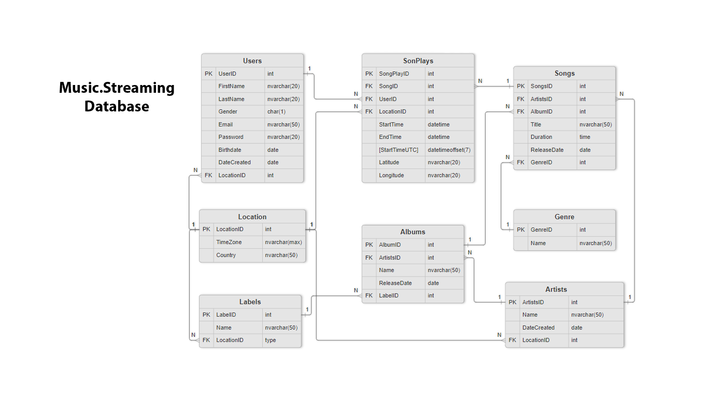

# Music Streaming: Data Analytics & Database Architecture

Banco de dados relacional completo e simulado de uma plataforma de **music streaming 24/7**. 

Este repositório reflete a evolução de um projeto de dados de ponta a ponta: inicia-se com a extração de inteligência de negócios através de **Análise de Dados em Python (2026)**, construída sobre uma fundação sólida de **Engenharia de Banco de Dados SQL (2022)**.

> **Guia de Leitura do Repositório:** 
> * **Parte 1:** Apresenta a minha recente extensão individual focada em **Análise de Dados (Python/Pandas)**.
> * **Parte 2:** Documenta o projeto original de **Arquitetura e Engenharia de Banco de Dados (DBA/SQL Server)**, que serve como base para as análises.

---

## 1. Análise Exploratória e Business Intelligence (Expansão 2026)
*Camada analítica independente desenvolvida para responder a perguntas estratégicas de negócio.*

As regras de negócio mapeadas no banco relacional foram traduzidas e otimizadas para processamento em DataFrames Pandas, focando no comportamento global do usuário e no desempenho do catálogo musical.

**[Acesse o Notebook Principal de Análise (Jupyter)](analise-python/notebooks/analise_exploratoria.ipynb)** | **🔗 [Leia o Guia](analise-python/README.md)**

### Desafios de Negócio Solucionados (Pandas)
Foram desenvolvidos scripts em Python para responder a 10 métricas essenciais do produto:

*   **Comportamento do Usuário:** Horários de pico de reproduções, duração média das sessões de escuta por país e volume de novos cadastros mensais.
*   **Desempenho de Catálogo:** Top 10 músicas e artistas mais reproduzidos, gêneros mais consumidos, ranking de reproduções por país e domínio das gravadoras.

### Destaque Analítico (Showroom de Código)
> **Insight Estratégico:** Identificação de retenção e engajamento real mapeando a duração exata das sessões de escuta por país, cruzando logs de reprodução com dados geográficos e cálculos de delta de tempo.

```python
duracao_sessao_pais = (
    pd.merge(df_songplays, df_location, on='LocationID', how='inner')
    .assign(
        Inicio=lambda df: pd.to_datetime(df['StartTime']),
        Fim=lambda df: pd.to_datetime(df['EndTime']),
        DuracaoMinutos=lambda df: (df['Fim'] - df['Inicio']).dt.total_seconds() / 60
    )
    .groupby('Country')
    .agg(
        TotalReproducoes=('SongPlayID', 'count'),
        DuracaoMediaMinutos=('DuracaoMinutos', 'mean')
    )
    .reset_index()
    .rename(columns= {'Country' : 'Pais'})
    .assign(DuracaoMediaMinutos=lambda df: df['DuracaoMediaMinutos'].round(2))
    .sort_values(by='DuracaoMediaMinutos', ascending=False)
)

duracao_sessao_pais
```

## 2. Arquitetura e Engenharia de Banco de Dados (Projeto Original 2022)

O projeto original cobre o ciclo completo de gestão de banco de dados em ambiente de produção: modelagem relacional, extração de insights de negócio, segurança e otimização de performance.

## Documentação completa

Consulte a [documentação técnica](docs/readme-docs.md) para o índice de cada script.

Para perguntas de negócio respondidas com SQL, veja [insights de negócio](docs/insights-negocios.md).

## Destaques técnicos

| Área | O que foi implementado |
|---|---|
| Modelagem | Diagrama ER com 8 tabelas: Songs, Artists, Albums, Genre, Users, Labels, Location e SongPlays |
| Consultas e relatórios | Queries analíticas para extração de insights de negócio via T-SQL |
| Segurança | TDE (Transparent Data Encryption), mascaramento dinâmico de dados (DDM), controle granular de permissões |
| Automatização | Backup automatizado com SQL Server Agent Jobs, stored procedures de auditoria e alertas |
| Performance | Particionamento de tabelas por data, compressão de dados, views, triggers e tabelas temporárias |

---

## Estrutura do projeto

```
Projeto_Music.Streaming/
├── analise-python/
│   ├── .env.example
│   ├── .gitignore
│   ├── requirements.txt
│   ├── conexao.py
│   ├── notebooks/
│   │   └── analise_exploratoria.ipynb
│   └── charts/
├── database/
│   ├── 01-modelagem/
│   │   ├── criacao-de-esquema.sql
│   │   ├── insercao-de-dados.sql
│   │   └── modelo-fisico.png
│   ├── 02-queries-relatorios/
│   │   └── consultas-e-relatorios.md 
│   ├── 03-seguranca-automacao/
│   │   ├── procedures-var-tde.sql
│   │   └── seguranca-agendamento.sql 
│   └── 04-performance-gestao/
│       ├── particionamento-compressao.sql
│       └── temp-tables-views-triggers.sql
├── docs/
│   ├── readme-docs.md
│   └── insights-negocios.md
└── README.md
```

---

## Como executar

### 1. Banco de dados (SQL Server)

```sql
CREATE DATABASE [Music.Streaming];
GO
USE [Music.Streaming];
GO
-- Em seguida, execute na ordem:
-- database/01-modelagem/criacao-de-esquema.sql
-- database/01-modelagem/insercao-de-dados.sql
```

### 2. Consultas e relatórios

Relatório em Markdown com explicações e blocos SQL:
`database/02-queries-relatorios/consultas-e-relatorios.md`

**3. Segurança e automação**
```sql
-- Criptografia TDE, procedures e auditoria
database/03-seguranca-automacao/procedures-var-tde.sql

-- Usuários, permissões, mascaramento e backup automatizado
database/03-seguranca-automacao/seguranca-agendamento.sql
```

**4. Performance e gestão avançada**
```sql
-- Particionamento por data e compressão de dados
database/04-performance-gestao/particionamento-compressao.sql

-- Views, triggers e tabelas temporárias
database/04-performance-gestao/temp-tables-views-triggers.sql
```

---

## Exemplos de uso

**Top 10 músicas mais tocadas:**
```sql
SELECT TOP 10 TituloMusica, TotalReproducoes
FROM #ContagemReproducoesPorMusica
ORDER BY TotalReproducoes DESC;
```

**Auditoria de jobs de backup:**
```sql
EXEC ListJobsAndSchedules
    @JobName    = 'BackupJob',
    @DataInicial = '2024-01-01',
    @DataFinal   = '2024-12-31';
```

**Visualização de dados mascarados (DDM):**
```sql
SELECT * FROM dbo.UserDM;
```

---

## Diagrama ER

[](database/01-modelagem/modelo-fisico.png)

> Clique na imagem para visualizar em tamanho completo.

---

## Boas práticas adotadas

- **Senhas:** nunca versionadas nos scripts — use os placeholders e substitua em produção
- **Backup:** certificado e chave mestra do TDE devem ser exportados e guardados com segurança
- **Permissões:** princípio do menor privilégio — cada usuário recebe apenas o acesso necessário
- **Auditoria:** triggers e logs rastreiam alterações em dados sensíveis
- **Performance:** monitoramento recomendado com `DBCC CHECKDB`, análise periódica de índices e partições
- **Documentação:** todos os scripts contêm comentários explicando cada etapa

---

## Tecnologias utilizadas


---

## Equipe

Projeto desenvolvido em equipe de 4 pessoas como trabalho prático da
**Academia Database & Data Intelligence — Rumos**.

| Membro | Responsabilidade principal |
|---|---|
| Felipe Guimarães Moraes | Modelagem ER, queries e relatórios, views, triggers e stored procedures |
| + 3 colaboradores | Desenvolvimento conjunto do projeto |

---