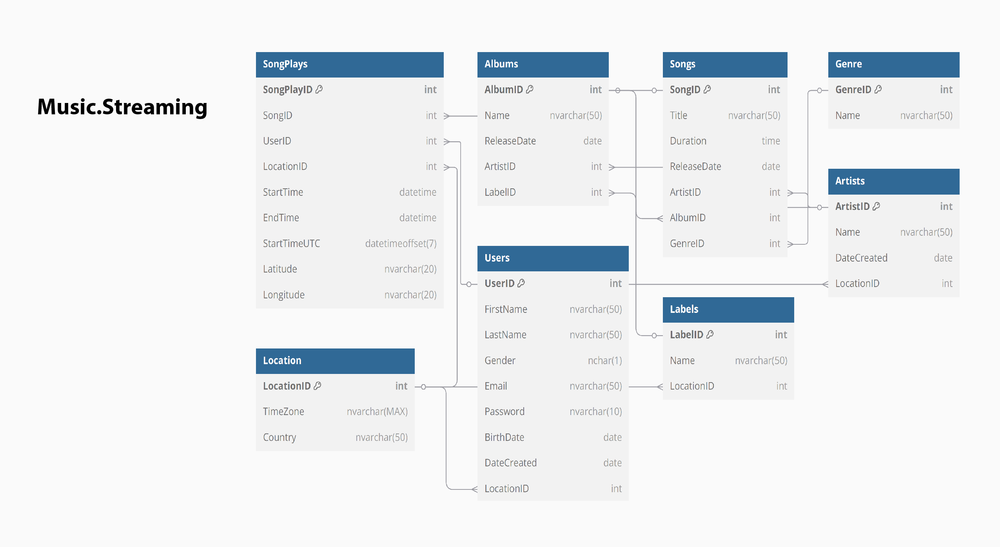

# 🎵 MusicStreaming Database

## 📖 Descrição do Projeto

O projeto **MusicStreaming Database** simula a base de dados de uma plataforma de streaming musical que funciona 24/7. Foi desenvolvido como parte prática da Academia Database & Data Intelligence, abordando desde a modelagem até estratégias avançadas de segurança, performance e relatórios.

A solução contempla:
- Modelagem e estruturação de entidades (usuários, músicas, artistas, álbuns, editoras, gêneros, etc.).
- Segurança, permissões e criptografia.
- Extração de relatórios e insights via SQL.
- Técnicas de performance como particionamento e compressão de dados.

## 🧱 Estrutura Principal

A documentação e scripts estão organizados por partes temáticas:

| Parte | Descrição |
|-------|-----------|
| [🧩 Modelagem Inicial](database/01-modelagem/) | Diagrama ER, criação de schema, inserção de dados |
| [📊 Consultas e Relatórios](database/02-queries-relatorios/) | SQL para extração de insights |
| [🔐 Segurança e Automatização](database/03-seguranca-automatizacao/) | Permissões, jobs, TDE, alertas |
| [📈 Gestão Avançada](database/04-gestao-avancada/) | Views, triggers, compressão e particionamento |

✅ Para ver todos os arquivos organizados com links: [Leia a documentação completa](docs/readme-docs.md)

## ⚙️ Tecnologias Utilizadas

- **SQL Server**
- **T-SQL**
- **Diagrama ER (modelo físico)**

## 🎯 Objetivo

Aplicar boas práticas de banco de dados em um contexto realista, com foco em modelagem eficiente, segurança de dados, relatórios úteis e estratégias de gestão de performance.

---

🖼️ **Preview do Diagrama ER**  
Clique na imagem para visualizar em tamanho completo:  

